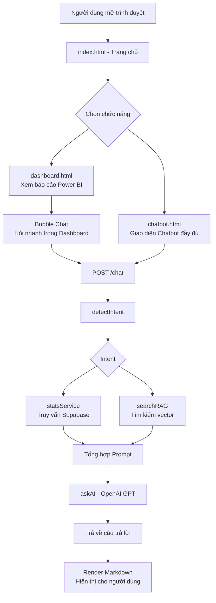

# Các Bước Thiết Kế Hệ Thống — Khóa Luận Tốt Nghiệp
## Đề tài: Ứng dụng Business Intelligence hỗ trợ ra quyết định kinh doanh cho CGV/VNPAY

---

## 1. Tổng quan hệ thống

### 1.1 Giới thiệu bài toán
Hệ thống được xây dựng nhằm hỗ trợ phân tích dữ liệu giao dịch bán vé xem phim của **CGV** thông qua kênh thanh toán **VNPAY**. Bài toán đặt ra là:
- Dữ liệu giao dịch lớn, khó đọc trực tiếp → cần **trực quan hóa** bằng Dashboard.
- Người dùng không chuyên kỹ thuật → cần **giao diện hỏi đáp tự nhiên** bằng Chatbot AI.
- Cần **hỗ trợ ra quyết định kinh doanh** dựa trên số liệu thực.

### 1.2 Mục tiêu hệ thống
| Mục tiêu | Giải pháp kỹ thuật |
|---|---|
| Trực quan hóa dữ liệu | Power BI Embedded (iframe) |
| Hỏi đáp dữ liệu bằng ngôn ngữ tự nhiên | Chatbot AI (Node.js + OpenAI) |
| Truy xuất tài liệu chính sách | RAG (Retrieval-Augmented Generation) |
| Lưu trữ vector embedding | Supabase (pgvector) |
| Giao diện người dùng | HTML/CSS/JavaScript thuần |

---

## 2. Kiến trúc tổng thể (System Architecture)

```
┌─────────────────────────────────────────────────────────────┐
│                        FRONTEND                             │
│  ┌──────────┐   ┌──────────────┐   ┌─────────────────────┐ │
│  │index.html│   │dashboard.html│   │    chatbot.html      │ │
│  │(Trang chủ)│  │ (Power BI)   │   │  (Chat + Sidebar)   │ │
│  └──────────┘   └──────┬───────┘   └──────────┬──────────┘ │
│                         │ iframe embed          │ fetch API  │
└─────────────────────────│───────────────────────│───────────┘
                          │                       │
          ┌───────────────┘         ┌─────────────┘
          ▼                         ▼
   Power BI Cloud          ┌─────────────────┐
   (app.powerbi.com)       │  BACKEND (Node) │
                           │   server.js     │
                           │  Express API    │
                           └──────┬──────────┘
                                  │
              ┌───────────────────┼──────────────────┐
              ▼                   ▼                  ▼
     ┌──────────────┐   ┌──────────────┐   ┌──────────────┐
     │chatController│   │  ragService  │   │  statsService│
     │(Điều phối)   │   │(Vector Search│   │(Truy vấn DB) │
     └──────┬───────┘   └──────┬───────┘   └──────┬───────┘
            │                  │                  │
            ▼                  ▼                  ▼
     ┌──────────────┐   ┌──────────────┐   ┌──────────────┐
     │  aiService   │   │   Supabase   │   │   Supabase   │
     │  (OpenAI)    │   │ (pgvector)   │   │  (Data DB)   │
     └──────────────┘   └──────────────┘   └──────────────┘
```

---

## 3. Thiết kế Cơ sở dữ liệu (Database Design)

### 3.1 Nguồn dữ liệu giao dịch (Supabase)
Dữ liệu giao dịch bán vé CGV/VNPAY được lưu trên **Supabase (PostgreSQL)**. Các trường dữ liệu chính bao gồm:

| Trường dữ liệu | Mô tả |
|---|---|
| `movie_name` | Tên phim |
| `cinema_name` | Tên rạp chiếu |
| `province_name` | Tỉnh/thành phố |
| `ticket_type` | Loại vé (2D, 3D, IMAX, ...) |
| `vnpay_price` | Giá bán thực qua VNPAY |
| `listed_price` | Giá niêm yết gốc |
| `transaction_date` | Ngày giao dịch |

### 3.2 Bảng RAG Documents (Vector Store)
Dùng để lưu tài liệu nội bộ phục vụ tìm kiếm ngữ nghĩa (RAG):

| Trường | Kiểu | Mô tả |
|---|---|---|
| `id` | UUID | Khóa chính |
| `title` | TEXT | Tiêu đề tài liệu |
| `content` | TEXT | Nội dung văn bản |
| `embedding` | VECTOR(384) | Vector embedding từ mô hình `all-MiniLM-L6-v2` |

> [!NOTE]
> Supabase hỗ trợ extension `pgvector` cho phép tìm kiếm vector tương đồng cosine — đây là nền tảng của hệ thống RAG.

---

## 4. Thiết kế Backend

### 4.1 Cấu trúc thư mục Backend

```
backend/
├── server.js              ← Entry point, khai báo API routes
├── .env                   ← Biến môi trường (API keys, URL)
├── config/
│   └── supabase.js        ← Khởi tạo Supabase client
├── controllers/
│   └── chatController.js  ← Điều phối toàn bộ logic chatbot
├── services/
│   ├── aiService.js       ← Gọi OpenAI API
│   ├── ragService.js      ← Tạo và tìm kiếm vector embedding
│   ├── statsService.js    ← Truy vấn số liệu thống kê từ Supabase
│   ├── docService.js      ← Đọc tài liệu Markdown nội bộ
│   └── movieService.js    ← Trích xuất tên phim từ câu hỏi
└── utils/
    ├── detechIntent.js    ← Phân loại intent của câu hỏi
    ├── format.js          ← Format tiền tệ VND
    └── provinces.js       ← Danh sách tỉnh/thành để nhận diện
```

### 4.2 Thiết kế API Endpoints

| Method | Endpoint | Chức năng |
|---|---|---|
| GET | `/` | Kiểm tra backend hoạt động |
| POST | `/chat` | Nhận câu hỏi, trả về câu trả lời AI |
| POST | `/api/rag/embed` | Tạo embedding cho tài liệu RAG mới |

### 4.3 Luồng xử lý Chat (`chatController.js`)

```
Người dùng gửi câu hỏi
        │
        ▼
[1] Nhận message từ request body
        │
        ▼
[2] detectIntent(message)
    → Phân loại 1 trong ~20 nhóm intent
    (revenue, top_movies, top_provinces, ...)
        │
        ▼
[3] Rẽ nhánh theo intent
    → Gọi hàm statsService tương ứng
    → Lấy dữ liệu từ Supabase
        │
        ▼
[4] Nếu intent là "general" hoặc "forecast"
    → searchRAG(message) để tìm tài liệu liên quan
        │
        ▼
[5] loadDocs() — Đọc tài liệu Markdown nội bộ
        │
        ▼
[6] Tổng hợp prompt gửi OpenAI:
    - Kiến thức tài liệu Markdown
    - Kiến thức RAG
    - Dữ liệu thống kê thực
    - Câu hỏi gốc
    - Quy tắc trả lời (bằng tiếng Việt, ngắn gọn...)
        │
        ▼
[7] askAI(prompt) → Nhận câu trả lời từ OpenAI
        │
        ▼
[8] Trả về { intent, reply } cho frontend
```

### 4.4 Thiết kế Module Nhận diện Intent (`detechIntent.js`)

Phân loại câu hỏi theo **keyword matching** — phương pháp đơn giản, hiệu quả cho tiếng Việt:

| Intent | Từ khóa nhận diện |
|---|---|
| `revenue` | "doanh thu" |
| `top_movies` | "phim", "phổ biến"/"nhiều nhất"/"top" |
| `top_provinces` | "tỉnh"/"thành phố", "top"/"nhiều nhất" |
| `top_cinemas` | "rạp", "top"/"nhiều nhất" |
| `top_movie_by_province` | "phim", "ở"/"tại" + tên tỉnh |
| `movie_month_trend` | "phim", "tháng" |
| `monthly_revenue` | "tháng", "doanh thu" |
| `marketing_priority` | "ưu tiên marketing" |
| `cinema_expansion` | "mở rộng rạp"/"mở thêm rạp" |
| `forecast` | "dự báo"/"năm sau" |
| `general` | Không khớp với nhóm nào |

### 4.5 Thiết kế Module RAG (`ragService.js`)

**RAG (Retrieval-Augmented Generation)** là kỹ thuật bổ sung ngữ cảnh cho LLM bằng cách truy xuất tài liệu liên quan:

```
Bước 1 — Chuẩn bị (offline):
  Tài liệu văn bản (.md, .docx)
        │ embedNewDocuments()
        ▼
  Mô hình: Xenova/all-MiniLM-L6-v2
        │ tạo vector 384 chiều
        ▼
  Lưu vào Supabase (bảng rag_documents.embedding)

Bước 2 — Truy vấn (online):
  Câu hỏi người dùng
        │ createEmbedding(query)
        ▼
  Vector câu hỏi
        │ match_rag_documents() — cosine similarity
        ▼
  Top 3 tài liệu liên quan nhất
        │
        ▼
  Đưa vào prompt cho OpenAI
```

---

## 5. Thiết kế Frontend

### 5.1 Cấu trúc thư mục Frontend

```
frontend/
├── html/
│   ├── index.html      ← Trang chủ (Sidebar + ảnh CGV)
│   ├── dashboard.html  ← Power BI + Bubble Chat
│   └── chatbot.html    ← Giao diện chat đầy đủ
├── css/
│   ├── index.css       ← Style trang chủ
│   ├── dashboard.css   ← Style trang Power BI
│   └── chatbot.css     ← Style giao diện chat
├── js/
│   ├── sidebar.js      ← Toggle sidebar (dùng chung)
│   ├── dashboard.js    ← Bubble chat, context menu
│   └── script.js       ← Logic chatbot đầy đủ
└── images/
    └── cgv.jpeg        ← Ảnh banner CGV
```

### 5.2 Mô tả từng trang

#### Trang chủ — `index.html`
- Sidebar với 2 menu: **Power BI** và **Chatbot**
- Vùng chính hiển thị ảnh banner CGV
- Điều hướng sang `dashboard.html` hoặc `chatbot.html`

#### Trang Power BI — `dashboard.html`
- Nhúng báo cáo Power BI qua `<iframe>` sử dụng **embedURL** và `autoAuth=true`
- **Bubble Chat** (mini chatbot nổi góc màn hình):
  - Click phải vào menu Chatbot → "Mở bubble chat"
  - Có thể minimize, đóng, khôi phục
  - Gửi câu hỏi tới `/chat` API
- Context menu tùy chỉnh (không dùng native browser menu)

#### Trang Chatbot — `chatbot.html`
- Sidebar bổ sung: nút "Cuộc trò chuyện mới", ô tìm kiếm, danh sách "Gần đây"
- Vùng chat chính: hiển thị tin nhắn người dùng và bot (hỗ trợ **Markdown** qua `marked.js`)
- Textarea tự động giãn khi gõ
- Modal đổi tên và modal xóa cuộc trò chuyện
- Lịch sử chat lưu vào **localStorage**

### 5.3 Luồng dữ liệu Frontend–Backend

```
[Người dùng gõ câu hỏi]
        │
        ▼
[script.js] sendMessage()
  → fetch("http://localhost:3000/chat", {
      method: "POST",
      body: JSON.stringify({ message: userInput })
    })
        │
        ▼
[Backend] chatController.chat()
  → Xử lý, truy vấn DB, gọi AI
        │
        ▼
[Trả về] { intent: "...", reply: "..." }
        │
        ▼
[script.js] Render reply dưới dạng Markdown
  → marked.parse(reply)
  → Thêm vào #chatBox
```

---

## 6. Thiết kế tích hợp Power BI

### 6.1 Cách nhúng Power BI
Sử dụng phương pháp **Embed with auto-authentication** (phù hợp cho nội bộ tổ chức):
```html
<iframe
  src="https://app.powerbi.com/reportEmbed
       ?reportId=<REPORT_ID>
       &autoAuth=true
       &ctid=<TENANT_ID>"
  frameborder="0"
  allowFullScreen="true">
</iframe>
```

### 6.2 Yêu cầu
- Tài khoản Microsoft 365 / Power BI Pro
- Report phải được **Publish** lên Power BI Service
- Người xem phải thuộc cùng **tenant (ctid)**

---

## 7. Thiết kế bảo mật & cấu hình

### 7.1 Biến môi trường (`.env`)
```
OPENAI_API_KEY=...       ← API key OpenAI (GPT)
SUPABASE_URL=...         ← URL project Supabase
SUPABASE_ANON_KEY=...    ← Anon key Supabase
PORT=3000
```

> [!CAUTION]
> File `.env` tuyệt đối **không được commit** lên Git. Đã có `.gitignore` để loại trừ.

---

## 8. Sơ đồ luồng tổng thể (Overall Flow)



---

## 9. Công nghệ sử dụng (Tech Stack)

| Lớp | Công nghệ | Phiên bản |
|---|---|---|
| Frontend | HTML5, CSS3, JavaScript (ES6+) | — |
| Markdown render | marked.js | CDN |
| Backend Runtime | Node.js + Express.js | Express v5 |
| AI Language Model | OpenAI GPT (API) | openai v6 |
| Embedding Model | Xenova/all-MiniLM-L6-v2 | @xenova/transformers v2 |
| Database & Vector Store | Supabase (PostgreSQL + pgvector) | supabase-js v2 |
| BI Visualization | Power BI Service (Embedded) | — |
| Document Parsing | mammoth (docx), csv-parser | — |
| HTTP Client | axios | v1 |
| Config | dotenv | v17 |

---

## 10. Quy trình kiểm thử

### 10.1 Kiểm thử Backend
- Dùng **Postman** hoặc **curl** gửi `POST /chat` với các câu hỏi mẫu
- Kiểm tra đúng intent được nhận diện (`"intent"` trong response)
- Kiểm tra dữ liệu trả về từ Supabase chính xác

### 10.2 Kiểm thử Frontend
- Kiểm tra giao diện trên trình duyệt (Chrome, Edge)
- Kiểm tra responsive sidebar (toggle ẩn/hiện)
- Kiểm tra lịch sử chat được lưu localStorage
- Kiểm tra bubble chat trên trang Dashboard

### 10.3 Kiểm thử RAG
- Gọi `POST /api/rag/embed` để tạo embedding cho tài liệu
- Đặt câu hỏi liên quan đến tài liệu → kiểm tra RAG context được đưa vào prompt

---

## 11. Hạn chế & hướng phát triển

### Hạn chế hiện tại
- Nhận diện intent bằng **keyword matching** — dễ miss với cách đặt câu hỏi khác nhau
- Chưa có **xác thực người dùng** (authentication)
- Dữ liệu Power BI yêu cầu cùng tenant Microsoft
- Chưa có **dự báo** (forecast model)

### Hướng phát triển
- Thay intent detection bằng **NLU model** (fine-tuned)
- Thêm **login/auth** bảo vệ dashboard nội bộ
- Tích hợp **Prophet / LSTM** để dự báo doanh thu
- Hỗ trợ **upload file CSV** để phân tích dữ liệu mới
- Deploy lên cloud (Railway, Render, Vercel)
